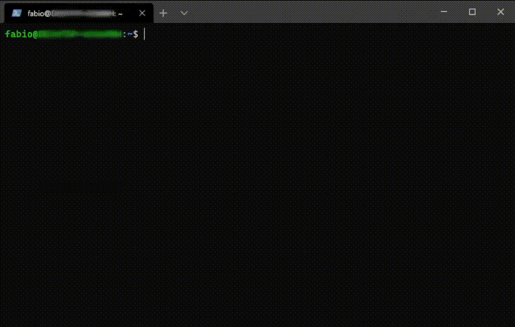
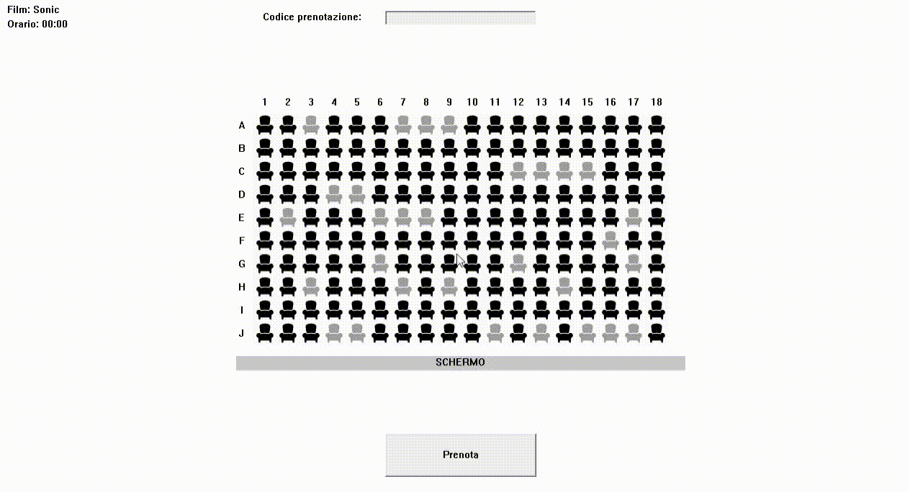

# Cinema Booking System

Client/server (WinAPI/POSIX) remote cinema hall seats reservation system.

Term paper of Operating Systems course.

## Overview

### Server

The server (multithreaded) accepts and processes concurrently the clients'
booking requests via TCP/IP.

### Client

The client provides the user with the following functions:
- Show the hall map to identify available seats.
- Send to the server the list of seats to be reserved.
- Retrieve the booking confirmation and a unique booking code from the server.
- Cancel the reservation associated with the code held.

